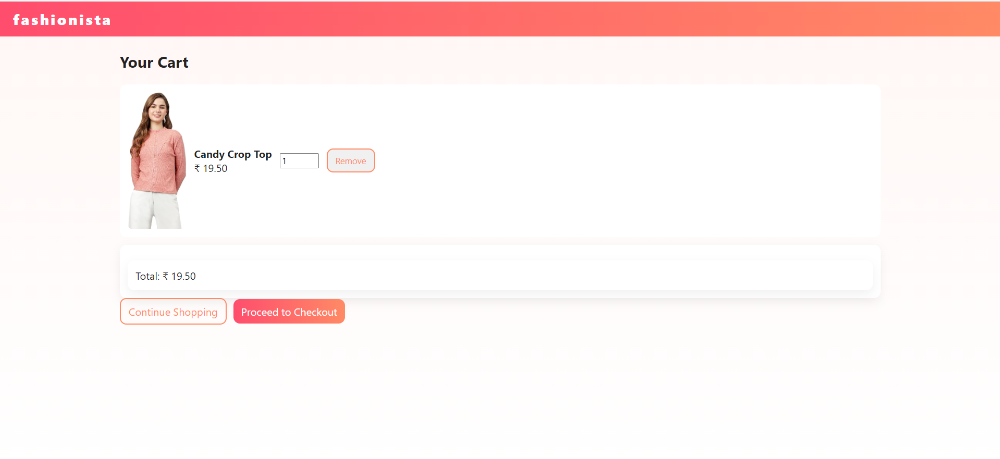
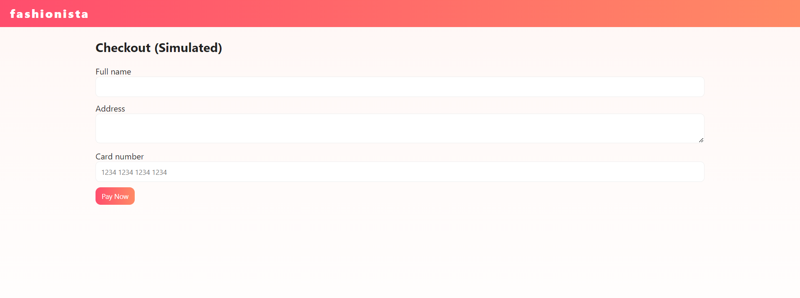
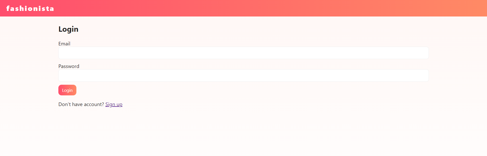
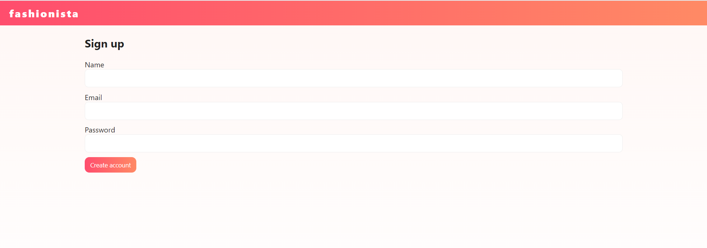

# Fashionista ECommerce Website

## 📸 Screenshots

### 🏠 Home Page

### 👗 Product View Page

### 🛒 Cart Page

### 💳 Checkout Page

### ✔️ Order Confirmation Page

### 🔐 Login Page

### 📝 Signup Page

## Overview

**Fashionista ** is a **full-stack e-commerce demo** showcasing a fashion store with interactive features, user authentication, and an admin panel. Built using **Python Flask**, **MySQL**, **HTML/CSS/JS**, it provides a modern, responsive, and animated UI for demonstration purposes.

## Features

### Products
- Multiple products with **sizes, colors, brand, price, and description**.
- Placeholder images (SVGs) included.
- **Instant Search** and **Sorting** by price, name, or brand.

### User Features
- **Signup/Login** system with MySQL support (fallback to JSON if MySQL not configured).
- **Favorites/Wishlist** stored in session.
- Interactive, session-based shopping experience.

### Admin Features
- Admin panel to **add/edit products** via forms.
- Simple admin authentication using `is_admin` flag in the database.

### UI & Styling
- Smooth animations and transitions.
- Responsive design with a **red/pink/orange theme**.
- Interactive hover effects for products.

## Tech Stack

- **Backend:** Python Flask
- **Frontend:** HTML5, CSS3, JavaScript
- **Database:** MySQL (optional, JSON fallback available)
- **Python Packages:** See `requirements.txt`

## Installation & Run Instructions

1. Clone or download the repository:
git clone <your-repo-url>
cd Fashionista-v2
Create & activate a virtual environment:

# Windows
python -m venv venv
venv\Scripts\activate

# macOS/Linux
python3 -m venv venv
source venv/bin/activate

Install dependencies:

pip install -r requirements.txt

Configure MySQL and initialize the database:

# Import the SQL file
mysql -u <username> -p <database_name> < init_db.sql

Run the application:
python app.py

Requirements:
Flask
mysql-connector-python==8.0.33
Werkzeug
See requirements.txt for complete list.

License
MIT License (Demo Project)

Author:
Nivedhitha K

